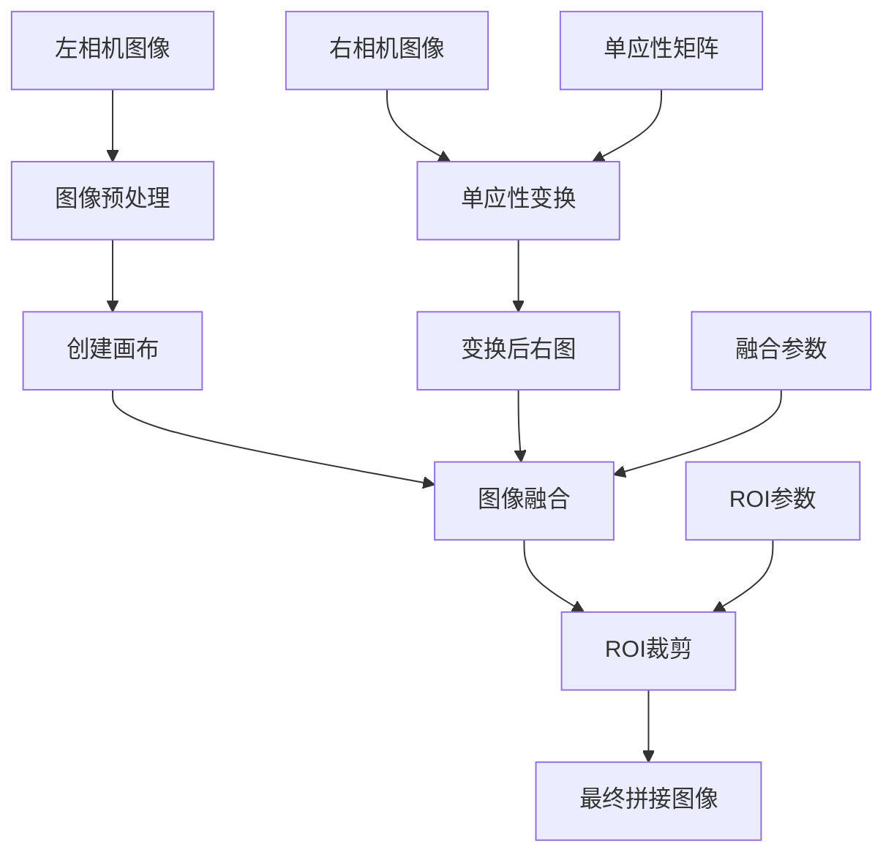
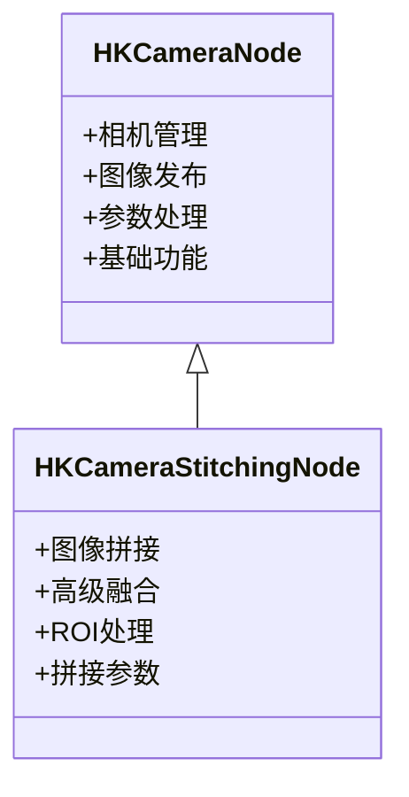

# 海康相机图像拼接系统原理与参数调整指南

## 1. 拼接原理概述

### 1.1 基本原理

图像拼接系统使用 **单应性变换 (Homography Transformation)** 将两个相机的图像合成为一个全景图像。核心思想是通过预先标定得到的变换矩阵，将右相机的图像变换到左相机的坐标系中，然后进行图像融合。

### 1.2 拼接流程



### 1.3 关键技术要点

#### 1.3.1 单应性变换 (Homography Transform)
- **目的**: 将右相机图像变换到左相机坐标系
- **数学基础**: 3x3 变换矩阵，描述平面到平面的投影变换
- **标定过程**: 通过棋盘格等标定板获得两相机间的几何关系

#### 1.3.2 图像融合 (Image Blending)
- **目的**: 在重叠区域平滑过渡，消除拼接缝隙
- **技术**: 多种融合算法（线性、加权、羽化）
- **效果**: 提高拼接图像的视觉质量

#### 1.3.3 ROI裁剪 (Region of Interest)
- **目的**: 从大的拼接画布中提取有效区域
- **优势**: 减少数据量，聚焦关键区域

## 2. 系统架构

### 2.1 类继承关系



### 2.2 核心组件

1. **相机管理器 (CameraManager)**: 负责双相机的初始化、图像采集
2. **拼接引擎**: 实现单应性变换和图像融合算法
3. **参数管理**: 动态参数配置和实时调整
4. **发布系统**: ROS2话题发布机制

## 3. 参数详解

### 3.1 基础配置参数

| 参数名 | 类型 | 默认值 | 说明 |
|--------|------|--------|------|
| `config_file` | string | "dual_camera.yaml" | 相机配置文件 |
| `homography_file` | string | "H_right_to_left.yaml" | 单应性矩阵文件 |
| `enable_stitching` | bool | true | 是否启用拼接功能 |
| `publish_individual_images` | bool | true | 是否发布单独相机图像 |
| `loop_rate_hz` | int | 60 | 处理频率(Hz) |

### 3.2 图像融合参数

#### 3.2.1 基础融合设置

| 参数名 | 类型 | 范围 | 默认值 | 说明 |
|--------|------|------|--------|------|
| `enable_blending` | bool | - | true | 启用重叠区域融合 |
| `blend_strength` | double | 0.0-1.0 | 1.0 | 融合强度 |
| `blend_mode` | string | - | "linear" | 融合模式 |

#### 3.2.2 融合模式详解

**1. "none" - 无融合**
- 简单覆盖，左图优先
- 速度最快，但有明显接缝
- 适用于实时性要求极高的场景

**2. "linear" - 线性融合**
- 重叠区域按固定比例混合
- 计算简单，效果中等
- 推荐用于大部分应用场景

**3. "weighted" - 加权融合**
- 根据距离边界的远近分配权重
- 边界过渡更自然
- 计算量适中，效果较好

**4. "feather" - 羽化融合**
- 创建渐变边界，最自然的过渡
- 计算量最大，效果最佳
- 适用于高质量要求的场景

#### 3.2.3 高级融合参数

| 参数名 | 类型 | 范围 | 默认值 | 说明 |
|--------|------|------|--------|------|
| `blend_feather_size` | int | 1-200 | 50 | 羽化边缘大小(像素) |
| `blend_overlap_priority` | string | - | "left" | 重叠区域优先级 |
| `blend_priority_strength` | double | 0.5-1.0 | 0.8 | 优先级强度(NEW!) |
| `blend_gamma_correction` | double | 0.5-2.0 | 1.0 | 伽马校正系数 |

**重叠优先级说明:**
- `"left"`: 左相机图像优先，适合左侧图像质量更好的情况
- `"right"`: 右相机图像优先，适合右侧图像质量更好的情况  
- `"center"`: 居中融合，平衡处理

**✅ 最新修复 (v2024.12):**
- **优先级功能已修复**: 现在可以实时切换左右优先级，立即生效
- **黑色三角形已修复**: 单应性变换现在使用白色背景，消除黑色区域
- **新增优先级强度控制**: `blend_priority_strength` 参数可调整优先级的强度

### 3.3 ROI裁剪参数

#### 3.3.1 拼接后ROI (推荐调整的主要参数)

| 参数名 | 类型 | 范围 | 默认值 | 说明 |
|--------|------|------|--------|------|
| `stitched_roi_x_percent` | double | 0.0-1.0 | 0.24 | 拼接图X起始位置(%) |
| `stitched_roi_y_percent` | double | 0.0-1.0 | 0.04 | 拼接图Y起始位置(%) |
| `stitched_roi_width_percent` | double | 0.0-1.0 | 0.53 | 拼接图宽度(%) |
| `stitched_roi_height_percent` | double | 0.0-1.0 | 0.95 | 拼接图高度(%) |

#### 3.3.2 单独相机ROI (可选)

控制单独发布的相机图像的裁剪区域，不影响拼接算法本身。

### 3.4 平场校正参数 (可选)

| 参数名 | 类型 | 默认值 | 说明 |
|--------|------|--------|------|
| `use_flat_field` | bool | false | 启用平场校正 |
| `flat_field_left` | string | "" | 左相机平场图像路径 |
| `flat_field_right` | string | "" | 右相机平场图像路径 |

## 4. 参数调整指南

### 4.1 快速调优流程

#### 步骤1: 检查基础拼接效果
```bash
# 启动拼接节点
ros2 launch hk_camera dual_camera_stitching.launch.py

# 查看拼接结果
ros2 run rqt_image_view rqt_image_view /stitched_image
```

#### 步骤2: 调整ROI参数
最关键的参数是拼接后ROI，建议按以下顺序调整：

1. **首先确定有效区域边界**
   ```bash
   # 查看调试图像，观察绿色(左相机)和红色(右相机)边界
   ros2 run rqt_image_view rqt_image_view /debug_image
   ```

2. **调整水平位置和宽度**
   ```bash
   # 动态调整参数
   ros2 param set /hk_camera_stitching_node stitched_roi_x_percent 0.2
   ros2 param set /hk_camera_stitching_node stitched_roi_width_percent 0.6
   ```

3. **调整垂直位置和高度**
   ```bash
   ros2 param set /hk_camera_stitching_node stitched_roi_y_percent 0.05
   ros2 param set /hk_camera_stitching_node stitched_roi_height_percent 0.9
   ```

#### 步骤3: 优化融合效果

1. **调整融合强度**
   ```bash
   # 减少融合强度 (更偏向原始图像)
   ros2 param set /hk_camera_stitching_node blend_strength 0.7
   
   # 增加融合强度 (更平滑过渡)
   ros2 param set /hk_camera_stitching_node blend_strength 1.0
   ```

2. **切换融合模式**
   ```bash
   # 尝试不同融合模式
   ros2 param set /hk_camera_stitching_node blend_mode "weighted"
   ros2 param set /hk_camera_stitching_node blend_mode "feather"
   ```

3. **调整羽化大小**
   ```bash
   # 适用于 feather 模式
   ros2 param set /hk_camera_stitching_node blend_feather_size 30
   ```

### 4.2 常见问题与解决方案

#### 问题1: 拼接缝隙明显
**现象**: 两个相机图像拼接处有明显的分界线

**解决方案**:
1. 启用融合: `enable_blending: true`
2. 增加融合强度: `blend_strength: 1.0`
3. 使用高级融合模式: `blend_mode: "feather"`
4. 增加羽化大小: `blend_feather_size: 80`

#### 问题2: 重叠区域模糊
**现象**: 重叠区域图像模糊或重影

**解决方案**:
1. 减少融合强度: `blend_strength: 0.5`
2. 调整重叠优先级: `blend_overlap_priority: "left"` 或 `"right"`
3. 检查单应性矩阵精度，可能需要重新标定

#### 问题3: 输出图像尺寸不符合要求
**现象**: 最终图像太大或太小

**解决方案**:
1. 调整拼接后ROI参数：
   - 缩小输出: 减少 `width_percent` 和 `height_percent`
   - 移动位置: 调整 `x_percent` 和 `y_percent`

#### 问题4: 性能问题
**现象**: 处理频率低，延迟大

**解决方案**:
1. 降低处理频率: `loop_rate_hz: 30`
2. 使用简单融合模式: `blend_mode: "linear"`
3. 减少羽化大小: `blend_feather_size: 20`
4. 禁用不必要功能: `publish_individual_images: false`

### 4.3 实时参数调整工具

#### 4.3.1 命令行工具
```bash
# 查看当前参数
ros2 param list /hk_camera_stitching_node

# 获取特定参数值
ros2 param get /hk_camera_stitching_node blend_strength

# 设置参数
ros2 param set /hk_camera_stitching_node blend_strength 0.8
```

#### 4.3.2 rqt参数调整界面
```bash
# 启动图形化参数调整工具
ros2 run rqt_reconfigure rqt_reconfigure
```

#### 4.3.3 参数保存
```bash
# 保存当前参数到文件
ros2 param dump /hk_camera_stitching_node > my_stitching_params.yaml
```

## 5. 性能优化建议

### 5.1 计算性能优化

1. **选择合适的融合模式**:
   - 实时性优先: `"linear"`
   - 平衡性能和质量: `"weighted"`
   - 质量优先: `"feather"`

2. **调整处理频率**:
   - 高速应用: 60-90 Hz
   - 一般应用: 30-60 Hz
   - 质量优先: 10-30 Hz

3. **ROI优化**:
   - 减小输出图像尺寸可显著提升性能
   - 合理设置ROI避免无效区域处理

### 5.2 内存使用优化

1. **禁用不必要的发布**:
   ```yaml
   publish_individual_images: false  # 如果不需要单独相机图像
   ```

2. **合理设置图像尺寸**:
   - 通过ROI控制输出图像大小
   - 避免过大的拼接画布

### 5.3 实时监控

系统提供性能监控信息，每5秒输出一次：
```
=== STITCHING NODE PERFORMANCE ===
Frame processing FPS: 58.32
Stitching FPS: 58.32
Loop rate setting: 60 Hz
==================================
```

## 6. 标定和配置文件

### 6.1 单应性矩阵标定

单应性矩阵通过相机标定获得，存储在 `H_right_to_left.yaml` 文件中：

```yaml
# H_right_to_left.yaml 示例
homography_matrix: !!opencv-matrix
   rows: 3
   cols: 3
   dt: d
   data: [ 9.8765e-01, -1.2345e-02,  1.2345e+02,
           2.3456e-03,  9.9876e-01, -5.6789e+01,
           1.2345e-06, -2.3456e-05,  1.0000e+00 ]
```

### 6.2 配置文件结构

主配置文件 `dual_camera_stitching.yaml` 包含所有可调参数。可以复制并修改此文件来适应不同的应用场景。

## 7. 故障诊断

### 7.1 常见错误信息

| 错误信息 | 可能原因 | 解决方案 |
|----------|----------|----------|
| "Failed to load homography matrix" | 单应性文件不存在或格式错误 | 检查文件路径和格式 |
| "CameraManager init failed" | 相机初始化失败 | 检查相机连接和配置 |
| "Long loop time" | 处理时间超时 | 降低频率或优化参数 |

### 7.2 调试工具

1. **话题监控**:
   ```bash
   ros2 topic list
   ros2 topic hz /stitched_image
   ros2 topic echo /stitched_image --once
   ```

2. **图像可视化**:
   ```bash
   # 查看拼接结果
   ros2 run rqt_image_view rqt_image_view /stitched_image
   
   # 查看调试图像(显示边界框)
   ros2 run rqt_image_view rqt_image_view /debug_image
   ```

3. **日志分析**:
   ```bash
   ros2 launch hk_camera dual_camera_stitching.launch.py --ros-args --log-level DEBUG
   ```

## 8. 最佳实践

### 8.1 参数调优建议

1. **分步调优**: 先基础功能，再优化效果，最后性能调优
2. **实时预览**: 使用 rqt_image_view 实时查看调整效果
3. **参数备份**: 调优完成后保存参数配置文件
4. **文档记录**: 记录不同场景下的最优参数组合

### 8.2 应用场景配置

#### 高速实时场景
```yaml
loop_rate_hz: 90
blend_mode: "linear"
blend_feather_size: 20
publish_individual_images: false
```

#### 高质量拼接场景
```yaml
loop_rate_hz: 30
blend_mode: "feather"  
blend_feather_size: 80
blend_strength: 1.0
```

#### 平衡性能场景  
```yaml
loop_rate_hz: 60
blend_mode: "weighted"
blend_feather_size: 50
blend_strength: 0.8
```

---

**维护说明**: 本文档基于当前系统版本编写，如系统更新请及时更新文档内容。 